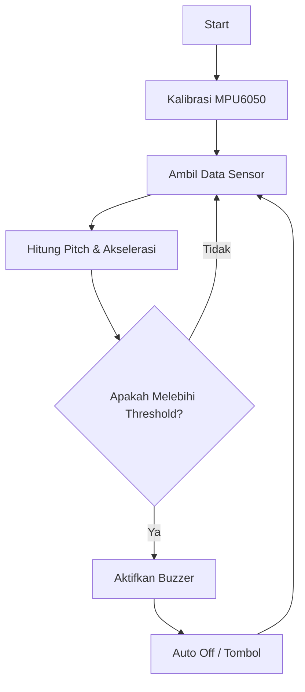

---

# 🚀 Smart Posture & Motion Detection System


> Sistem deteksi postur dan gerakan berbasis Arduino menggunakan MPU6050 dengan fitur peringatan otomatis 🚨

---

## 📖 Overview

Project ini adalah sistem embedded yang digunakan untuk mendeteksi **kemiringan dan gerakan tubuh secara real-time** menggunakan sensor MPU6050.

Ketika terdeteksi posisi tidak normal atau gerakan mencurigakan, sistem akan memberikan **peringatan melalui buzzer**.

Cocok untuk:

* Monitoring postur tubuh 🧍‍♂️
* Deteksi kantuk (head nodding) 😴
* Project IoT & wearable device 📡

---

## ✨ Features

* 📊 Real-time motion tracking (accelerometer + gyroscope)
* 📐 Deteksi kemiringan (tilt detection)
* 🚨 Buzzer alert otomatis
* 🔘 Tombol untuk mematikan buzzer
* 🔧 Kalibrasi sensor otomatis saat startup
* 📉 Konversi data ke satuan fisik (m/s² & °/s)

---

## 🧠 System Workflow



---


### 📍 Pin Configuration

| Komponen    | Arduino Pin |
| ----------- | ----------- |
| MPU6050 SDA | A4          |
| MPU6050 SCL | A5          |
| Buzzer      | 12          |
| Button      | 7           |

---

## ⚙️ Installation

1. Clone repository ini:

```bash
git clone https://github.com/username/smart-posture-mpu6050.git
```

2. Buka di Arduino IDE

3. Install library:

* `Wire.h`
* `MPU6050.h`

4. Upload ke board Arduino kamu 🚀

---

## 🛠️ Calibration

Saat pertama dinyalakan, sistem akan melakukan kalibrasi:

* Durasi: ±2 detik
* Pastikan sensor dalam kondisi **diam dan stabil**

```cpp
calibrateMPU(2000);
```

---

## 📊 Detection Logic

Sistem akan mengaktifkan buzzer jika:

* Kemiringan sumbu X/Y melebihi batas tertentu
* (Opsional) Gerakan cepat terdeteksi dari gyroscope

```cpp
if (ax1 < -25 || ax1 > 15 || ay1 > 18 || ay1 < -20) {
  startBuzzer();
}
```

---

## 💡 Future Improvements

* 💾 Simpan kalibrasi ke EEPROM
* 📱 Integrasi dengan mobile app / dashboard
* 🎯 Tambahkan filter (Kalman / Complementary)
* 🧠 Machine learning untuk deteksi pola gerakan
* 
---

## 🤝 Contributing

Kontribusi sangat terbuka!
Silakan fork repo ini dan buat pull request 🚀

---

## 👤 Author

**Wafi**
🎓 Student | 💻 Tech Enthusiast | 🚀 Future Informatics Engineer

**Fatra**
🎓 Student

---

## ⭐ Support

Kalau project ini membantu, jangan lupa kasih ⭐ di repo ya!

---
